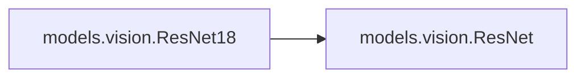
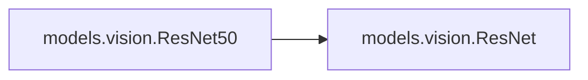
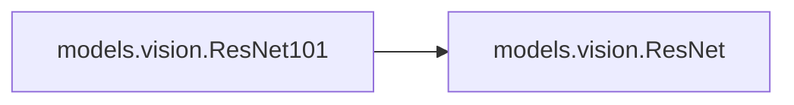
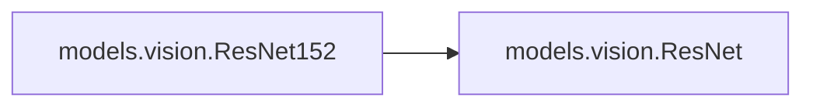

# Models Vision

[_Documentation generated by Documatic_](https://www.documatic.com)

<!---Documatic-section-Codebase Structure-start--->
## Codebase Structure

<!---Documatic-block-system_architecture-start--->
```mermaid
None
```
<!---Documatic-block-system_architecture-end--->

# #
<!---Documatic-section-Codebase Structure-end--->

<!---Documatic-section-models.vision.weights_init-start--->
## [models.vision.weights_init](3-models_vision.md#models.vision.weights_init)

<!---Documatic-section-weights_init-start--->
<!---Documatic-block-models.vision.weights_init-start--->
<details>
	<summary><code>models.vision.weights_init</code> code snippet</summary>

```python
def weights_init(m):
    if hasattr(m, 'weight'):
        m.weight.data.uniform_(-0.5, 0.5)
    if hasattr(m, 'bias'):
        m.bias.data.uniform_(-0.5, 0.5)
```
</details>
<!---Documatic-block-models.vision.weights_init-end--->
<!---Documatic-section-weights_init-end--->

# #
<!---Documatic-section-models.vision.weights_init-end--->

<!---Documatic-section-models.vision.ResNet18-start--->
## [models.vision.ResNet18](3-models_vision.md#models.vision.ResNet18)

<!---Documatic-section-ResNet18-start--->


### Object Calls

* models.vision.ResNet

<!---Documatic-block-models.vision.ResNet18-start--->
<details>
	<summary><code>models.vision.ResNet18</code> code snippet</summary>

```python
def ResNet18():
    return ResNet(BasicBlock, [2, 2, 2, 2])
```
</details>
<!---Documatic-block-models.vision.ResNet18-end--->
<!---Documatic-section-ResNet18-end--->

# #
<!---Documatic-section-models.vision.ResNet18-end--->

<!---Documatic-section-models.vision.ResNet34-start--->
## [models.vision.ResNet34](3-models_vision.md#models.vision.ResNet34)

<!---Documatic-section-ResNet34-start--->


### Object Calls

* models.vision.ResNet

<!---Documatic-block-models.vision.ResNet34-start--->
<details>
	<summary><code>models.vision.ResNet34</code> code snippet</summary>

```python
def ResNet34():
    return ResNet(BasicBlock, [3, 4, 6, 3])
```
</details>
<!---Documatic-block-models.vision.ResNet34-end--->
<!---Documatic-section-ResNet34-end--->

# #
<!---Documatic-section-models.vision.ResNet34-end--->

<!---Documatic-section-models.vision.ResNet50-start--->
## [models.vision.ResNet50](3-models_vision.md#models.vision.ResNet50)

<!---Documatic-section-ResNet50-start--->


### Object Calls

* models.vision.ResNet

<!---Documatic-block-models.vision.ResNet50-start--->
<details>
	<summary><code>models.vision.ResNet50</code> code snippet</summary>

```python
def ResNet50():
    return ResNet(Bottleneck, [3, 4, 6, 3])
```
</details>
<!---Documatic-block-models.vision.ResNet50-end--->
<!---Documatic-section-ResNet50-end--->

# #
<!---Documatic-section-models.vision.ResNet50-end--->

<!---Documatic-section-models.vision.ResNet101-start--->
## [models.vision.ResNet101](3-models_vision.md#models.vision.ResNet101)

<!---Documatic-section-ResNet101-start--->


### Object Calls

* models.vision.ResNet

<!---Documatic-block-models.vision.ResNet101-start--->
<details>
	<summary><code>models.vision.ResNet101</code> code snippet</summary>

```python
def ResNet101():
    return ResNet(Bottleneck, [3, 4, 23, 3])
```
</details>
<!---Documatic-block-models.vision.ResNet101-end--->
<!---Documatic-section-ResNet101-end--->

# #
<!---Documatic-section-models.vision.ResNet101-end--->

<!---Documatic-section-models.vision.ResNet152-start--->
## [models.vision.ResNet152](3-models_vision.md#models.vision.ResNet152)

<!---Documatic-section-ResNet152-start--->


### Object Calls

* models.vision.ResNet

<!---Documatic-block-models.vision.ResNet152-start--->
<details>
	<summary><code>models.vision.ResNet152</code> code snippet</summary>

```python
def ResNet152():
    return ResNet(Bottleneck, [3, 8, 36, 3])
```
</details>
<!---Documatic-block-models.vision.ResNet152-end--->
<!---Documatic-section-ResNet152-end--->

# #
<!---Documatic-section-models.vision.ResNet152-end--->

[_Documentation generated by Documatic_](https://www.documatic.com)